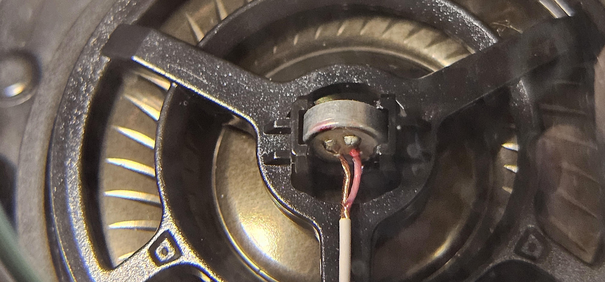
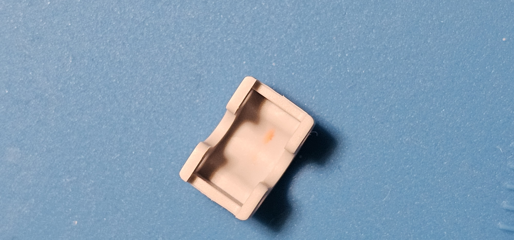
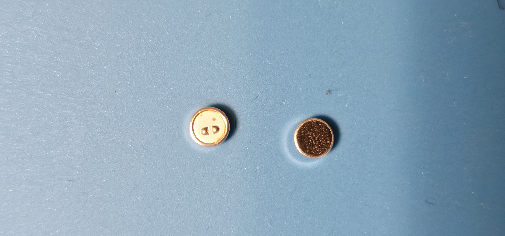
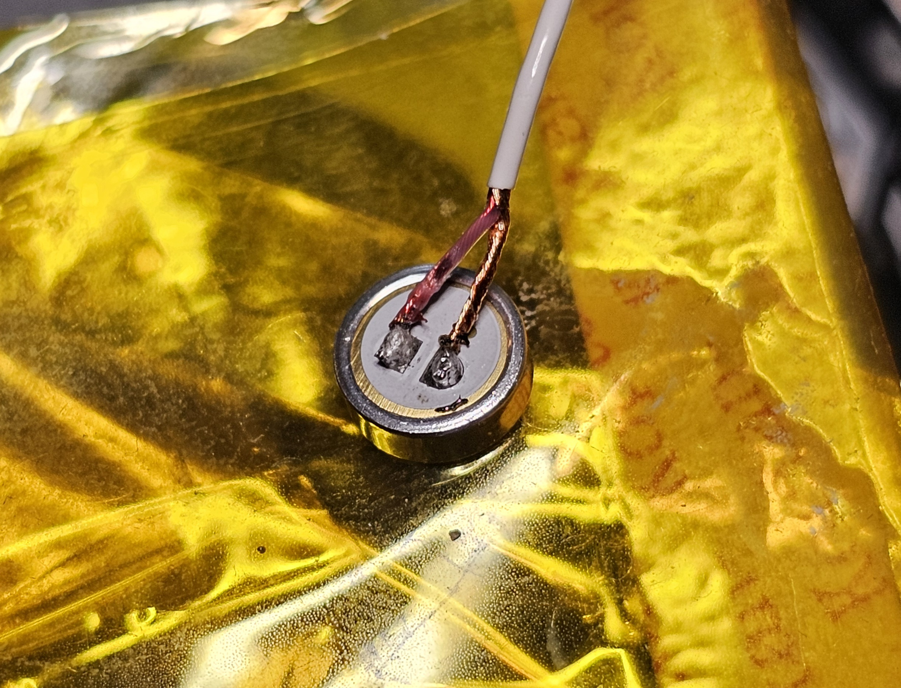

# Sony WH-1000XM4 ANC Repair

This repository documents how I diagnosed and repaired a Sony WH-1000XM4 headset with unstable Active Noise Cancelling (ANC).

## The problem

My headphones started making a high-pitched squealing noise, but only when ANC was enabled. The problem became more noticeable over time, especially after longer use. Normal audio playback still worked.

## Initial suspicion

At first, I was not sure whether the issue came from software, sealing, moisture, or one of the ANC microphones. After comparing the symptoms with similar reported failures and looking at how the problem behaved, the external feedforward microphone became the main suspect.

## What I found

After opening the earcup, I found visible discoloration and residue near the microphone housing. Cleaning the area improved the behavior temporarily, which made the microphone even more likely as the source of the problem.

I did not use laboratory measurements or oscilloscope testing here. The diagnosis was based on symptom behavior, visual inspection, comparison with similar known failures, and the final repair result.

## Repair

I replaced the original microphone with a compatible electret microphone that matched the required sensitivity more closely than common lower-sensitivity alternatives.

During soldering, I kept the temperature controlled and the contact time short to avoid damaging the replacement microphone.

## Result

After the replacement, the ANC squealing disappeared and the headphones worked normally again. I did not notice any obvious loss in audio quality or ANC performance during normal use.

## What this project shows

- practical fault diagnosis
- electronics disassembly and repair
- component selection using datasheets
- precision soldering
- technical documentation

## Repository contents

- `XM4_Repair.pdf` – full report
- `images/` – repair photos
- `media/` – supplementary videos
- `README.md` – project summary

## Images

### Original microphone and visible oxidation

## Replacement microphone and soldering

## Full report

[Open the report](./XM4_Repair.pdf)

## Note

This repair was done carefully and at my own risk. Opening consumer electronics may void warranty.
